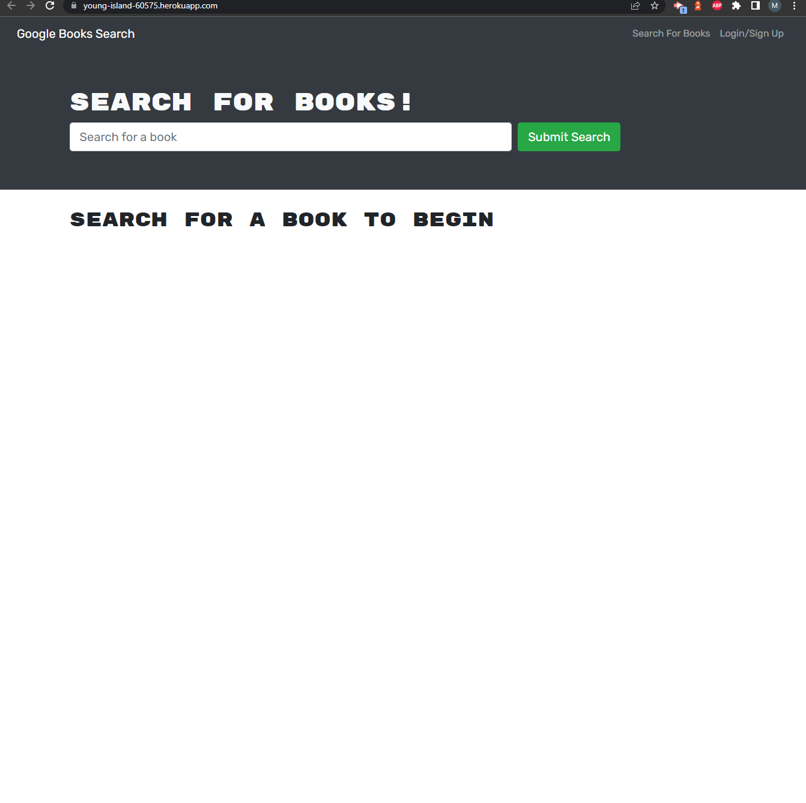

# Book Search

## Description

This project converted a functioning book-search app from using a REST API to GraphQL. Users can create an account, search for books using Google Books, and add/remove books from their saved list, which is stored on a MongoDB database.
[link to live application](https://young-island-60575.herokuapp.com/)

